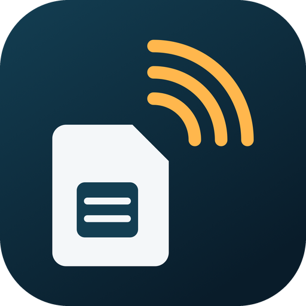
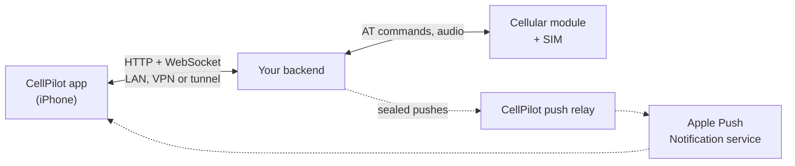

<p align="center">
  
</p>

<h1 align="center">CellPilot Device API</h1>

<p align="center">
  The open contract between the CellPilot iPhone app and the backend that drives your cellular module.
</p>

<p align="center">
  <b>English</b> · <a href="README.zh-CN.md">简体中文</a>
</p>

<p align="center">
  <a href="spec/device-api.md"></a>
  <a href="spec/openapi.yaml"></a>
  <a href="tools/"></a>
  <a href="LICENSE"></a>
</p>

---

> Use CellPilot only lawfully — see [Legal](#legal).

CellPilot is an iPhone app designed so that people whose iPhone takes only eSIM do not miss the
texts and calls of a physical SIM card of their own. The card sits in a cellular module — a 4G
module on a Mac, a modem on a home server — and CellPilot brings its texts, calls, voicemail and
notifications to the iPhone, even when the app is closed. It is made mainly for receiving:
calling and texting are there for the occasional need and are strictly limited. A number you use
every day belongs in your phone, or on an eSIM.

The app does not talk to the module. It talks to a **backend**: a program you run next to the
module that exposes it over HTTP and a WebSocket. This repository is everything needed to write
one — the specification, machine-readable schemas, a guide with an example for every route, and
tools that check a backend without the app.

Calls and messages travel directly between the app and the backend; no server of ours carries
them. The one service CellPilot runs, the [push relay](#push-relay), is optional: with push on, a
notification about a new message, call or voicemail passes through it end-to-end encrypted, which
the relay is designed to be unable to decrypt.

## How it fits together



The app pairs with the backend once, then reaches it through whatever endpoints the backend
lists: a LAN address, a Tailscale name, a Cloudflare Tunnel, a reverse proxy. Calls and messages
travel between the two directly. Pushes are sealed with a key only the app and the backend hold:
when the backend follows the specification, the relay forwards them without being able to read
their contents, and neither can Apple; both still see delivery metadata — when a push is sent, to
which device, and what kind of notification it is.

## What is in this repository

| Path | What it is |
| --- | --- |
| [`spec/device-api.md`](spec/device-api.md) | **The specification.** Normative: where anything else disagrees, this wins. |
| [`spec/device-api.zh-CN.md`](spec/device-api.zh-CN.md) | The specification in Chinese. |
| [`spec/openapi.yaml`](spec/openapi.yaml) | Every route and object, OpenAPI 3.1. [`openapi.json`](spec/openapi.json) is the same for tools; [`openapi.zh-CN.yaml`](spec/openapi.zh-CN.yaml) is a translation. |
| [`spec/events.schema.json`](spec/events.schema.json) | Every frame on the event stream, JSON Schema 2020-12. |
| [`docs/`](docs/) | The backend guide, in [English](docs/index.html) and [Chinese](docs/zh-CN.html): one entry per route with parameters, examples and pitfalls. |
| [`tools/api-check.mjs`](tools/api-check.mjs) | Conformance checker: every response and frame against the schemas. |
| [`tools/mock-backend.mjs`](tools/mock-backend.mjs) | The smallest backend the app works with, in one file. |
| [`tools/test-relay.mjs`](tools/test-relay.mjs) | A local stand-in for the push relay. |
| [`fixtures/number-rules.json`](fixtures/number-rules.json) | How phone numbers are stored, read and shown, as a table of cases. |
| [`ACCEPTABLE_USE.md`](ACCEPTABLE_USE.md) | What CellPilot may and may not be used for. |
| [`NOTICE.md`](NOTICE.md) | Trademarks, third-party data and encryption. |

The tools need Node.js 22 or later and nothing else. The guide is plain HTML: open
`docs/index.html` in a browser.

## Quick start

Run the mock backend and check it, in two terminals:

```sh
node tools/mock-backend.mjs --port 8799 --code 123456
```

```sh
TOKEN=$(curl -s -X POST http://127.0.0.1:8799/v1/pair -d '{"code":"123456","name":"api-check"}' \
  | node -pe 'JSON.parse(require("fs").readFileSync(0, "utf8")).token')

node tools/api-check.mjs --url http://127.0.0.1:8799 --token "$TOKEN" \
  --write --to +15555550101 --dial --sim --code 123456
```

No line should read `FAIL` (`skip` marks a feature the mock does not declare). To see the mock from the phone, add a backend in the app by its
address (`http://<your computer's LAN address>:8799`) and enter the code it prints.

## Building a backend

1. **Read the core.** [`spec/device-api.md`](spec/device-api.md) lists what every backend must
   implement: discovery, pairing, status, the call and its audio frames, the call history,
   messages, and the event stream. The [guide](docs/index.html) walks through each route.
2. **Start from something that works.** Read `tools/mock-backend.mjs`, or adapt a project you
   already have. Build against a simulated device first: the simulation hooks
   (`POST /_sim/sms`, `/_sim/call`, …) let the checker make things happen.
3. **Check it.** `tools/api-check.mjs` is read-only by default: it is designed not to change
   anything, so it can be run against a backend with a real SIM.
   With a simulated device, `--write --dial --sim --code` exercises sending, calling, arrivals,
   notify and acknowledgements, audio, and re-pairing.
4. **Add features as you can honestly offer them.** A backend declares what it supports in
   `GET /v1`; the app shows only those. Undeclared is always fine.
5. **Get numbers right.** Run your number handling against
   [`fixtures/number-rules.json`](fixtures/number-rules.json) so your backend reads every number
   the way the app does.
6. **Add push** last: enrol on the relay through the app, and test the whole path locally with
   `tools/test-relay.mjs`, including every refusal the relay can give.

### Features

The core is required. Everything else is optional and declared by the backend.

| Feature | Adds |
| --- | --- |
| *core* | Pairing, status, calls with audio, call history, conversations and messages, the event stream |
| `push` | Notifications through the relay when the app is closed, VoIP pushes for incoming calls |
| `notify` | Asking live clients before pushing, so a phone with the app open is not notified twice |
| `snapshot` | Everything a client keeps, at one version, in one request |
| `contacts` | Contacts kept by the backend, matched to numbers |
| `search` | Full-text search over messages |
| `trash` | Deleted conversations kept for restoring |
| `voicemail` | An answering machine that picks up unanswered calls and records them |
| `transcription` | Live and on-demand transcripts of voicemail |
| `screening` | Sending a ringing call to the answering machine, and taking it back |
| `settings` | Backend settings the user can change from the app |
| `security` | Tamper checks on the device, and alerts |
| `log` | The backend's event log, in the reader's language |
| `places` | Where a number is from, and its carrier |
| `portal` | A web page of the backend's own, opened inside the app |

## Push relay

The app cannot be woken by a backend directly; Apple only accepts pushes from the holder of the
app's key. CellPilot runs a relay at `https://push.cellpilot.dev` that forwards pushes for
enrolled backends; it is currently invitation-only. Every push from a backend that follows the
specification is sealed with a key derived from the client's token, so the relay cannot read its
contents. The relay refuses any push without a sealed payload except a bare badge count; the few
fields Apple needs in the clear — a generic alert text of up to 40 characters, the category and
the badge — stay readable. A backend is enrolled from the app, under the user's Sign in with
Apple identity, and can reach only that user's phones. Limits, quotas and how they are counted
are set by the relay and may change. The protocol, signatures and test vectors are in the
specification under *Push*.

## Compatibility

We intend version 1 only to grow. Nothing documented is removed or changes meaning; new things
arrive as optional fields, new event types and new features. Clients ignore what they do not
know, and so do backends. A change that cannot keep this would be version 2, on its own base path.
We may still change or withdraw something when security, law, Apple's platform rules or the
relay's operation require it; such changes are announced in [CHANGELOG.md](CHANGELOG.md). Nothing
here is a warranty of continued compatibility or availability.

## Reference backend

`cellpilotd`, a Node.js backend for a USB 4G module on macOS, is the reference implementation the
app is tested against. It is not published; it is named only so the specification can say what
one real backend chooses. Where it says what `cellpilotd` does, that is one choice within the
rules, not a requirement.

## Contributing

Questions, unclear passages and mistakes in the specification are welcome as issues; see
[CONTRIBUTING.md](CONTRIBUTING.md). Security problems — in the protocol, the relay or the tools —
go through [SECURITY.md](SECURITY.md), not public issues.

## Legal

**Lawful use only.** CellPilot is made only for lawful purposes. We abide by the law and do not
endorse, support or assist any unlawful activity. If you find a problem — misuse, or anything in
the product or these documents that conflicts with laws or regulations — please tell us right
away at abuse@cellpilot.dev. We will cooperate with the authorities and rectify it, and if
necessary change, restrict or shut down the feature or service concerned. Use of CellPilot is
subject to the [acceptable use policy](ACCEPTABLE_USE.md): your own SIM, from your own devices;
no fraud, bulk or automated calls or messages, caller-ID changes, SIM pools or code-receiving
services.

**Made for receiving.** Calls and texts are limited to what one person needs now and then: each
day, calls to 3 and texts to 3 numbers that are not contacts and have not contacted you, no links
to such numbers, 20 calls and 30 texts in all. The app enforces this, and a backend should too
(see *Outbound limits* in the [specification](spec/device-api.md)).

**Not for emergencies.** CellPilot is not a replacement for phone service. A call depends on your
Internet connection, your backend, the module and the carrier, and an emergency call leaves from
the module's location, so it may reach the wrong emergency centre, which sees the wrong location.
In an emergency, use a regular phone.

**Recording.** The answering machine, call screening and transcription record and transcribe
callers. Depending on where the caller and the user are, the law may require telling the caller
or getting their consent; whoever runs the backend is responsible for complying.

**No warranty.** The specification, guide, schemas and tools are provided "as is", without
warranty of any kind, as the [license](LICENSE) states. The push relay is a separate service: it
is currently invitation-only, offered on terms given to invitees, and it may change, be limited
or end.

**Trademarks.** Apple, iPhone and the other product and company names in this repository belong
to their owners and are named only to describe compatibility or give examples; CellPilot is not
affiliated with, endorsed or sponsored by them. See [NOTICE.md](NOTICE.md), which also covers
third-party data and encryption.

**Reporting.** Misuse, or anything in CellPilot or these documents that conflicts with laws or
regulations: abuse@cellpilot.dev. Security vulnerabilities: [SECURITY.md](SECURITY.md).

## License

[MIT](LICENSE). The specification, schemas, guide and tools may be used to build any backend,
open or closed.

The CellPilot name and logo are not covered by the license. You may say that your backend works
with CellPilot, but not name it, or present it, as if it came from CellPilot, and the logo in
[`assets/`](assets/) may not be used in your own project.
