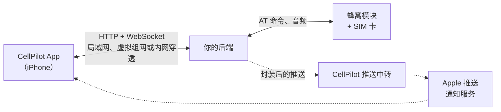

<p align="center">
  
</p>

<h1 align="center">CellPilot 设备 API</h1>

<p align="center">
  CellPilot iPhone App 与驱动你的蜂窝模块的后端之间的开放契约。
</p>

<p align="center">
  <a href="README.md">English</a> · <b>简体中文</b>
</p>

<p align="center">
  <a href="spec/device-api.zh-CN.md"></a>
  <a href="spec/openapi.zh-CN.yaml"></a>
  <a href="tools/"></a>
  <a href="LICENSE"></a>
</p>

---

> 请只以合法方式使用 CellPilot——见[法律声明](#法律声明)。

CellPilot 是一个 iPhone App，设计初衷是让只能使用 eSIM 的 iPhone 用户，不错过自己另一张实体 SIM 卡上的短信和来电。
这张卡插在蜂窝模块里——接在 Mac 上的 4G 模块、家里服务器上的调制解调器——CellPilot 把它的短信、来电、留言和通知带到 iPhone 上，
App 关着时也能收到。它以接收为主：拨号和发短信只是为偶尔的必要情况提供的便利，有严格的次数限制。日常使用的号码请放进手机，或转为 eSIM。

App 不直接和模块对话，而是连接一个**后端**：你在模块旁边运行的程序，通过 HTTP 和 WebSocket 把模块暴露
出来。这个仓库包含编写后端所需的一切——规范、机器可读的 schema、每个接口都带示例的指南，以及不用 App
就能检查后端的工具。

通话和短信在 App 与后端之间直接传输，不经由我们的任何服务器承载。CellPilot 运营的唯一服务是
[推送中转](#推送中转)，它是可选的：开启推送时，关于新短信、来电或留言的通知会经过中转，它是端到端加密的，中转按设计无法解密。

## 整体结构



App 和后端配对一次，之后通过后端列出的任意端点连接它：局域网地址、Tailscale 名称、Cloudflare
Tunnel、反向代理。通话和短信在两者之间直接传输。推送用只有 App 和后端持有的密钥封装：后端遵循规范时，中转只负责转发，读不到推送内容，Apple 也读不到；它们仍能看到投递所需的元数据——发送时间、目标设备和通知类型。

## 仓库内容

| 路径 | 内容 |
| --- | --- |
| [`spec/device-api.md`](spec/device-api.md) | **规范（英文）。** 最终依据：其他任何文件与它不一致时，以它为准。 |
| [`spec/device-api.zh-CN.md`](spec/device-api.zh-CN.md) | 规范的中文版。 |
| [`spec/openapi.yaml`](spec/openapi.yaml) | 所有路由和对象，OpenAPI 3.1。[`openapi.json`](spec/openapi.json) 内容相同，供工具读取；[`openapi.zh-CN.yaml`](spec/openapi.zh-CN.yaml) 是中文译本。 |
| [`spec/events.schema.json`](spec/events.schema.json) | 事件流上的每一种帧，JSON Schema 2020-12。 |
| [`docs/`](docs/) | 后端指南，[英文](docs/index.html)和[中文](docs/zh-CN.html)两版：每个接口一节，含参数、示例和注意事项。 |
| [`tools/api-check.mjs`](tools/api-check.mjs) | 一致性检查：每个响应和帧都对照 schema 检查。 |
| [`tools/mock-backend.mjs`](tools/mock-backend.mjs) | App 能用的最小后端，单个文件。 |
| [`tools/test-relay.mjs`](tools/test-relay.mjs) | 本地模拟的推送中转。 |
| [`fixtures/number-rules.json`](fixtures/number-rules.json) | 电话号码如何保存、识别和显示，写成一张用例表。 |
| [`ACCEPTABLE_USE.md`](ACCEPTABLE_USE.md) | CellPilot 可以和不可以用来做什么。 |
| [`NOTICE.md`](NOTICE.md) | 商标、第三方数据和加密说明。 |

工具只需要 Node.js 22 或更新版本，没有其他依赖。指南是普通 HTML，用浏览器打开 `docs/zh-CN.html` 即可。

## 快速上手

在两个终端里分别启动模拟后端并检查它：

```sh
node tools/mock-backend.mjs --port 8799 --code 123456
```

```sh
TOKEN=$(curl -s -X POST http://127.0.0.1:8799/v1/pair -d '{"code":"123456","name":"api-check"}' \
  | node -pe 'JSON.parse(require("fs").readFileSync(0, "utf8")).token')

node tools/api-check.mjs --url http://127.0.0.1:8799 --token "$TOKEN" \
  --write --to +15555550101 --dial --sim --code 123456
```

不应出现 `FAIL`（`skip` 表示模拟后端没有声明的特性）。想在手机上看看这个模拟后端：在 App 里按地址添加后端
（`http://<你电脑的局域网地址>:8799`），输入它打印出来的配对码。

## 编写后端

1. **先读核心部分。** [`spec/device-api.zh-CN.md`](spec/device-api.zh-CN.md) 列出每个后端必须实现的
   内容：发现、配对、状态、通话及其音频帧、通话记录、短信和事件流。[指南](docs/zh-CN.html)逐个讲解每个接口。
2. **从能跑的东西开始。** 读 `tools/mock-backend.mjs`，或者改造你已有的项目。先接模拟设备：有了模拟
   接口（`POST /_sim/sms`、`/_sim/call` 等），检查工具才能触发来信、来电这些事件。
3. **检查。** `tools/api-check.mjs` 默认只读，按设计不做任何改动，可以对插着真 SIM 卡的后端运行。对模拟设备加上
   `--write --dial --sim --code`，会实际测试发短信、拨号、来信来电、notify 和确认、音频以及重新配对。
4. **能做到的特性再声明。** 后端在 `GET /v1` 里声明支持哪些特性，App 只显示这些。不声明永远没问题。
5. **号码要处理对。** 用 [`fixtures/number-rules.json`](fixtures/number-rules.json) 跑一遍你的号码处理，
   让后端对每个号码的理解和 App 一致。
6. **最后加推送：** 通过 App 在中转登记，并用 `tools/test-relay.mjs` 在本地测试整条推送路径，包括中转可能给出的每一种拒绝。

### 特性

核心部分是必须的，其余都是可选的，由后端自行声明。

| 特性 | 增加的能力 |
| --- | --- |
| *核心* | 配对、状态、带音频的通话、通话记录、会话和短信、事件流 |
| `push` | App 关着时经中转推送通知，来电用 VoIP 推送 |
| `notify` | 推送前先问在线的客户端，App 开着的手机不会收到两次通知 |
| `snapshot` | 客户端需要保存的全部内容，同一版本，一次请求取回 |
| `contacts` | 后端保存的联系人，按号码匹配 |
| `search` | 短信全文搜索 |
| `trash` | 删除的会话先进回收站，可以恢复 |
| `voicemail` | 答录机：接听无人接的来电并录音 |
| `transcription` | 留言的实时转写和按需转写 |
| `screening` | 把响铃中的来电交给答录机，也能再接回来 |
| `settings` | 用户可以在 App 里修改的后端设置 |
| `security` | 设备防篡改检查和告警 |
| `log` | 后端的事件日志，按读者的语言显示 |
| `places` | 号码归属地和运营商 |
| `portal` | 后端自己的网页，在 App 里打开 |

## 推送中转

后端没法直接唤醒 App；Apple 只接受持有 App 密钥的一方发来的推送。CellPilot 在
`https://push.cellpilot.dev` 运营一个中转，替登记过的后端转发推送；它目前仅限受邀使用。符合本规范的后端发出的每条推送
都用从客户端令牌派生的密钥封装，中转读不到其内容。没有封装载荷的推送中转一律拒绝，只有单独的角标数除外；Apple 需要以明文传递的
少数字段——不超过 40 个字符的通用提示文字、类别和角标——仍然可读。后端通过 App 登记，挂在用户的"通过 Apple 登录"身份下，
只能推送到这个用户自己的手机。限额、配额及其计算方式由中转设定，可能会变化。协议、签名和测试向量见规范的"推送"一节。

## 兼容性

我们打算让 v1 只增不改。文档里写了的东西不会删除，含义也不会改变；新内容以可选字段、新事件类型和新特性的形式加入。
客户端忽略不认识的内容，后端也一样。做不到这一点的改动会是 v2，使用单独的基础路径。但在安全、法律、Apple 平台规则或
中转运营需要时，我们仍可能变更或撤回某些内容；这类变更会在 [CHANGELOG.md](CHANGELOG.md) 中公布。这里的任何内容都不是
对持续兼容或持续可用的保证。

## 参考后端

`cellpilotd` 是一个跑在 macOS 上、驱动 USB 4G 模块的 Node.js 后端，是 App 测试所用的参考实现。它没有公开，
提到它只是为了让规范能说明一个真实后端的做法；规范里说 `cellpilotd` 怎么做时，说的是规则之内的一种选择，不是要求。

## 参与贡献

规范里的疑问、写得不清楚的地方和错误，欢迎提 issue，见 [CONTRIBUTING.md](CONTRIBUTING.md)。安全问题——
协议、中转或工具里的——请按 [SECURITY.md](SECURITY.md) 报告，不要公开提 issue。

## 法律声明

**仅限合法用途。** CellPilot 仅为合法用途而制作。我们遵守法律法规，不认可、不支持、也不协助任何违法活动。如果你发现问题——
滥用，或产品、本文档中有任何与法律法规相抵触的内容——请立即通过 abuse@cellpilot.dev 告诉我们。我们会配合有关部门并予以整改，
必要时变更、限制或关闭相关功能或服务。CellPilot 的使用受[合法使用条款](ACCEPTABLE_USE.md)约束：用你自己的 SIM 卡、
在你自己的设备上使用；不得用于诈骗，不得批量或自动拨打电话、发送短信，不得更改主叫号码、搭建 SIM 卡池或经营接码服务。

**以接收为主。** 拨号和短信限制在一个人偶尔需要的范围内：每天最多拨打 3 个、发短信给 3 个不在通讯录也没有联系过你的号码，
不能给这类号码发带链接的短信，全部通话每天最多 20 通、短信最多 30 条。App 会执行这些限制，后端也应当执行
（见[规范](spec/device-api.zh-CN.md)中的“外发限制”）。

**不能用于紧急呼叫。** CellPilot 不能替代电话服务。通话依赖你的互联网连接、后端、模块和运营商；紧急呼叫从模块所在地发出，
可能接到错误的急救中心，对方看到的也是错误的位置。遇到紧急情况，请使用普通电话。

**录音。** 答录机、来电筛选和转写会对来电者录音并转写。视来电者和用户所在地的法律，可能需要告知来电者或取得其同意；
后端的运行者负责遵守这些法律。

**不提供担保。** 规范、指南、schema 和工具按 [许可证](LICENSE) 所述"按原样"提供，不附带任何形式的担保。推送中转是一项单独的服务：
它目前仅限受邀使用，按提供给受邀者的条款提供，可能会变更、受到限制或终止。

**商标。** Apple、iPhone 以及本仓库中出现的其他产品和公司名称归各自的所有者所有，提到它们只是为了说明兼容性或举例；
CellPilot 与它们没有关联，也未得到其认可或赞助。详见 [NOTICE.md](NOTICE.md)，其中也说明了第三方数据和加密。

**举报。** 滥用行为，或 CellPilot、本文档中任何与法律法规相抵触的内容：abuse@cellpilot.dev。安全漏洞：[SECURITY.md](SECURITY.md)。

## 许可证

[MIT](LICENSE)。规范、schema、指南和工具都可以用来编写任何后端，开源或闭源都可以。

CellPilot 名称和图标不在许可范围内。你可以说明自己的后端可以配合 CellPilot 使用，但不能用这个名称为它命名，
或让人以为它出自 CellPilot；[`assets/`](assets/) 里的图标也不能用在你自己的项目里。
